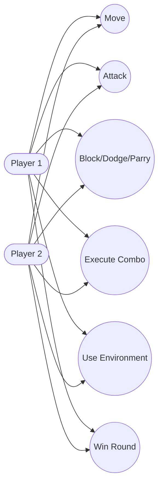
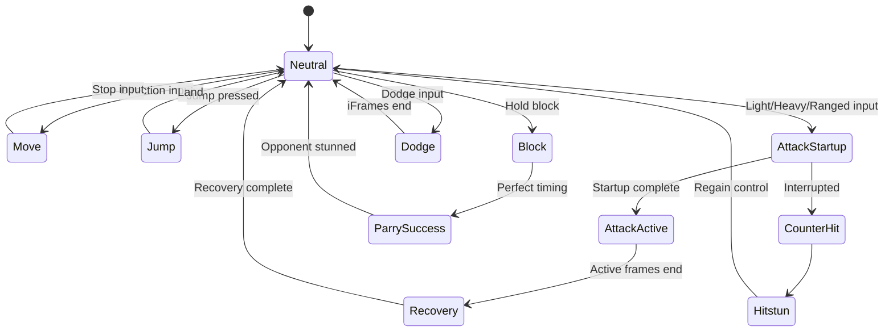
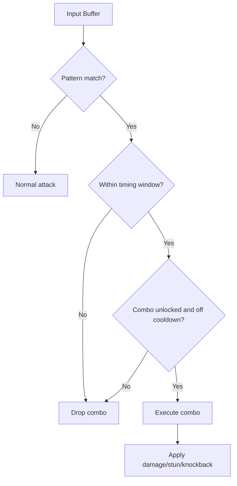
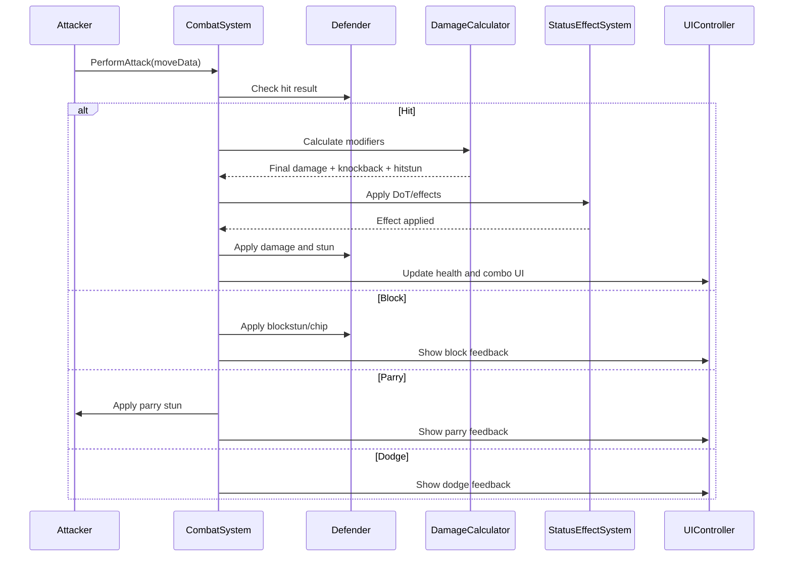
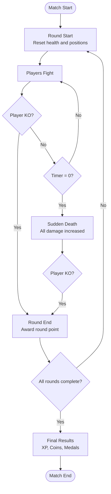
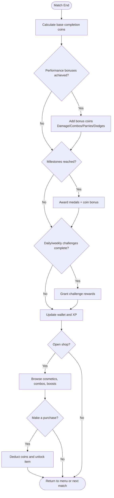
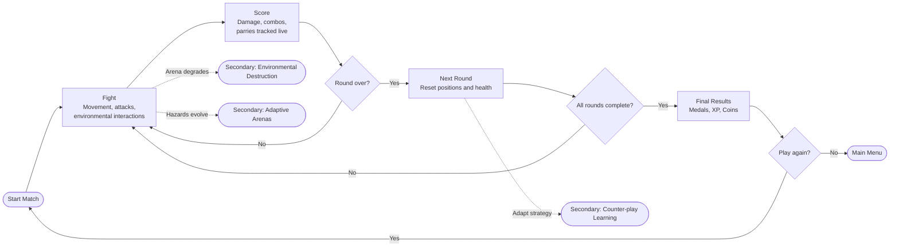
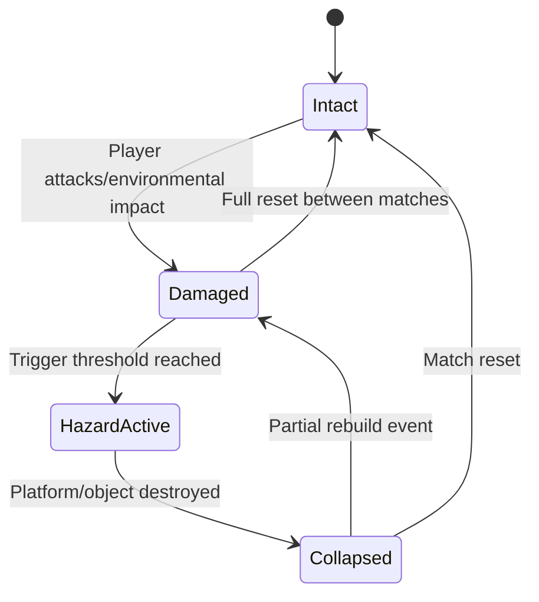

Gameplay and mechanics

# 1.	Gameplay Overview

The gameplay of Path of the immortals is based on one on one versus battles, with each battle designed to test the players skill of timing, character proficiency, and spacing. The core actions include a walk, run, basic attack, heavy attack, ranged attack, and a jump, the foundation of the combat system has allowed for players to experiment with combos and use their own fighting style with the selected fighter. The game's difficulty spike primarily consists of who is playing, with certain players being more proficient than others, yet with it being mostly designed as a local based fighter, both players will be relative in skill enabling players to learn attack combinations and build their confidence.

The main appeal of Path of the immortals is the merging of Greek mythology, and a modern 2D fighter game. Each character has their own distinct mechanics allowing for battles to keep their originality and the animations are designed around capturing expressions with limbs being moved and visual effects being presented when attacks are executed. The combat in path of the immortals prioritises responsiveness for players to quickly be rewarded or punished for their actions through a game. The game is uniquely present from other 2D fighter games due to it being accessibility at the cost of nothing for the player, the playable characters allow for progression through skill mastery, which is gained by playing the game, overall creating a game narrative that is both visually and mechanically appealing.

## 1.1. Audio-informed combat readability

Audio is designed as gameplay feedback rather than only atmosphere, following evidence that game audio contributes to informing, entertaining, and immersing players at the same time (Andersen et al., 2021, p. 223).

For combat events, sound effects are prioritised for hit confirms, parry success, dodge timing, combo completion, and round/state transitions, as sound effects were identified as the most important game audio element for enthusiasm and immersion (Andersen et al., 2021, p. 231).

This supports faster player interpretation of combat states and aligns with findings that players generally performed better in unmuted conditions during gameplay tests (Andersen et al., 2021, pp. 227–229).

## 1.2. UML diagram - Core player use cases

***

# 2.	Core mechanics

## 2.1.	Movement

###  2.1.1. Controls

#### Keyboard & Mouse

| Action | Input |
| --- | --- |
| Jump | Space |
| Move | A/D or Arrow Keys |
| Combo directional input | W/S or Up/Down Arrows |
| Light attack | Left Mouse Button |
| Heavy attack | Right Mouse Button |
| Charge heavy attack | Hold Right Mouse Button |
| Block/Parry | Shift |
| Dodge/Dash | E or Middle Mouse Button |
| Ranged attack | Q or Mouse Wheel (aim with mouse cursor) |
| Combos | Directional Keys + Attack Buttons |

#### Controller (Xbox/PlayStation)

| Action | Input |
| --- | --- |
| Jump | A/X |
| Move | Left Joystick |
| Combo directional input | Right Joystick |
| Light attack | X/Square |
| Heavy attack | B/Circle |
| Charge heavy attack | Hold X/Square |
| Block/Parry | LB/L1 or B/Circle |
| Dodge/Dash | Y/Triangle or RB/R1 |
| Ranged attack | Press in right joystick and point in a direction |
| Combos | Directional Joystick Input + Attack Buttons |

> Combos can be executed by combining directional keys (WASD or Arrow Keys) with attack buttons in specific patterns.
> For example: W, W, Left Click or A, Space, Left Click, E

> The right joystick is where controller players will combine combos by pushing it in certain directions in a pattern to execute a combo.

> All controls are fully customizable by the player so they can be as comfortable as possible with either input method.

### 2.1.2. Feeling to the player

* The goal is to keep the movement fluid and responsive to the player. While keeping an arcade feel while straying away from button mashing, skills can be developed with more play time by learning how characters can be countered, how maps adapt to gameplay, different combinations of abilities and being better and blocking and parrying.

### 2.1.3. How are they going to move?

* Moving in a 2D space, players can go left and right, and some maps may use vertical space too. Dashing can be used to quickly get out of the way, while parrying can be used in movement is not an option. Players can use a multitude of different movement abilities assigned to their character to move freely around the pantheon.

### 2.1.4. How are heavy, medium, and light characters going to be different? 

1. Heavy (Titan) – normal move speed but slowed down quite a bit when performing heavier attacks and combos leaving them vulnerable. Heavy classed character will be able to do and take more damage but are left more vulnerable due to the lack of movement abilities. Characters in this class are also able to use larger objects in the pantheon as weapons or to create space.

2. Medium (God) – fully balanced with normal move speed and normal penalties to heavy attacks and combos. This class can move around easily, attack and defend themselves with balance.

3. Light (Demi God) – slightly faster base move speed and more movement abilities, faster light attacks but deal less damage but heavy attacks still take a few seconds to perform leaving them vulnerable to attacks. Light classed characters will have attacks that allow them to move and damage at the same time. This class can also use smaller objects in the pantheon to their advantage but can the strength to use larger objects.

### 2.1.5. General movement such as:

* Walking
* Dashing
* Parrying 
* Light attacks
* Heavy attacks
* Ranged attacks
* Combos

## 2.2.	Attacks

### 2.2.1. **Light attacks:**

* These are light and fast attacks that the player will use. These attacks do a regular amount of damage to the enemy player and can be performed in succession. These are performed by using the light attack button (Left Mouse Button on keyboard, or X/Square on controller).

### 2.2.2. **Heavy attacks:**

* These are slow hard-hitting attacks that deal more damage than to other types but take a few seconds to charge/cast. These leave the player vulnerable to attacks and will suffer a penalty to cooldowns if hit during the prep of the attack. Heavy attacks can be used to create distance and control the space; some attacks may leave the other player stunned for a bit leaving them vulnerable to attacks and combos. These are performed by pressing and holding the heavy attack button (Hold Right Mouse Button on keyboard, or Hold X/Square on controller) and let go when fully charged.

### 2.2.3. **Ranged attacks:**

* Ranged attacks are to hit the other player at a distance, these are in place to allow balance during fights. These attack either have a short cool down but do low damage or have a longer cooldown and do high damage. These are performed by pressing the ranged attack button and aiming (Q key with mouse cursor on keyboard, or press in right joystick and point in direction on controller).

## 2.3.	Blocking, dodging and parrying

### 2.3.1. Blocking

Players can block using the block button (Shift key on keyboard, or LB/L1 or B/Circle on controller), while holding it down players will not take damage but in the final blow is of a chained combo, then the player will break from the block and take damage.

### 2.3.2. Dodging

The player can use the dodge button (E key on keyboard, or Y/Triangle or RB/R1 on controller) to dodge in the direction they are moving in. Some characters (light classes) will be able to do damage if they dodge through the other player. Dodging is added to allow space control for players, this enables players to change positioning easily.

### 2.3.3. Parrying

If the player presses the blocking button (Shift key on keyboard, or LB/L1 or B/Circle on controller) at the exact time a attack lands on them then the will parry, temporarily stunning the other player, if the attack is a ranged attack then the ranged attack will be deflected back to the attacker. Although parrying ranged attack might seem beneficial, these won't damage the attacker at 100% the attack damage but at a 50% - 75% depending on the travel time, this will be calculated with a drop-off mechanic.

## 2.4.	Combos

### 2.4.1 Special combos:

Players can use a multitude of combos that would be listed on each character, these are special moves that perform specific actions. These are performed by combining different buttons pressed in succession.

**Keyboard examples:** W, W, Left Click or A, Space, Left Click, E

**Controller examples:** X, X, Square or Left flick, X, Square, Triangle 

### 2.4.2. Chained combos:

Chained combos are when the player pressed or uses the same attack button in succession. These range from all types of attacks; light, heavy and ranged. These are performed by pressing different attacks in a chained way.

**Keyboard example:** Left Click, Left Click, Left Click (three light attacks)

**Controller example:** X, X, X

After the final hit is landed, both players will have a change to either retaliate or block/move.

## 2.5.	Environmental interactions

Every pantheon will have some objects that can be used by the player. They are either small or large objects that can be thrown, only heavy fighters can use larger objects though. Smaller objects thrown by light classes will travel farther and do slightly more damage.

## 2.6.	Character abilities

•	Each playable character will have their own assigned abilities that can be accessed by combining buttons...

## 2.7. UML diagrams - Movement and combo logic

# 3.	Combat System

## 3.1.	Combo structure and levels

* Levels

Each combo will be graded in three levels, combo complexity and how much damage the combos do.

* Examples

* Level 1 combos:

**Keyboard:** Left Click, Left Click, Left Click - Three light attacks that end with a third final hit that pushes the other player back and stuns them for a moment.
**Controller:** X, X, X

**Keyboard:** Space, Hold Right Click - Causes the player to jump into the air and then land with a heavy attack causing damage in the surrounding area.
**Controller:** A, Hold X

* Level 2 combos:

**Keyboard:** Left Click, Left Click, Left Click, Q (aim with mouse) - Shoot multiple projectiles.
**Controller:** X, X, X, Right Joystick (aim)

* Level 3 combos:
	… : …….

## 3.2.	Damage types or modifiers

* Each character with me equipped with melee and ranged weapons, depending on their back story. Some weapons will have damage over time effects such as shock, fire, freezing or poison.  If weapons have different types of damage over time effects then these weapons will have blunt or slash damage. Depending on characters, some weapons might cause the other player to be pushed back due to it being a big heavy weapon, and some might be smaller blades that attack faster but have a shorter range and less damage.

> > ## 3.3.	Hitstun, knockback, parries, counters

## 3.4.	How skill expression is rewarded

* By countering attacks and way the enemy player is playing, players will be rewarded with things such as extra space to reposition…

## 3.5.	Anti-button-mashing design choices

* Attacks are limited to three presses such as the chained light attack (Left Click, Left Click, Left Click on keyboard, or X, X, X on controller), as pressing a fourth time wouldn't cause the player to attack as they have momentum from the third press still. All hits and appropriate button presses will have delays to allow for fair fighting. iFrames?

## 3.6. UML diagram - Attack resolution sequence

# 4.	Round Structure

## Flowchart

## 4.1.	Time limits

•	Rounds will be times 3-5 depending on modes.

## 4.2.	Scoring metrics (Damage, kills, deaths, combos)

•	Different medals will be awarded to players for the amount of damage done, successful kills, least deaths, amount of combos used, etc.

## 4.3.	How rounds transition

•	Players health and position reset once the timer ends, if no player has been killed, the timer will be paused at zero and sudden death mode activates where all attacks do more damage and once a player dies then the round moves on.

## 4.4.	What player see at the end of a round

## 4.5.	Audio cues for round events

Round flow uses distinct audio cues at each state transition (round start, low-time pressure, sudden death activation, KO confirmation, and round-end stingers) so players can identify match phase quickly without depending only on visual UI.

This event-based approach is consistent with findings that suitable audio increases engagement and supports gameplay performance, while unsuitable background music can reduce perceived fit in the moment (Andersen et al., 2021, pp. 229–231).

# 5.	Progression Systems

Players earn points and coins by completing rounds, achieving certain combat milestones and performing well in matches. Coins can be used to unlock cosmetic items, additional combos, and character‑specific upgrades.

## 5.0. UML diagram - Rewards and shop loop

## 5.1.	How players earn points/coins
* Match completion rewards:

 Guaranteed coins for finishing a match.

* Performance bonuses:

 Extra coins for damage dealt, combos landed, parries executed, and successful dodges.

* Medals:

 Achievements based on gameplay milestones (e.g., “Untouchable,” “Combo Master,” “Titan Slayer”). Medals grant additional coins.

* Daily/weekly challenges:

 Rotating objectives such as “Perform 5 Level 2 combos” or “Win 3 matches using a Light class fighter.”

## 5.2.	How the shop works

The shop is accessible between rounds (In specific modes) or from the main menu. It includes:

* Cosmetics: Skins, weapon variants, colour palettes, emotes, and victory poses.

* Combo unlocks (In modes such as arena): Higher‑tier combos (Level 2 and 3) can be purchased for each character.

* Environmental interactions: Optional unlockable that add new objects or hazards to arenas.

* Progression boosts: Temporary XP boosts or coin multipliers for players who want to progress faster.

Items rotate weekly to encourage variety and ongoing engagement.

## 5.3.	Combo unlocks (level 1-3)

* Level 1 Combos: Basic abilities available from the start.
* Level 2 Combos: More advanced attacks requiring coins to unlock; add movement, elemental damage, and more complex directional inputs.
* Level 3 Combos:  =High‑impact, high‑skill moves. These combine multiple buttons and joystick input. They have longer cooldowns but can shift the tide of battle.

Unlocking combos increases a character’s combat style and adds long‑term progression for players.

## 5.4.	How progression affects strategy

* Fighters grow more specialised.
* Counter‑play deepens because advanced combos add more telegraphs, openings, and stun windows.
* Players must adapt strategies across rounds depending on their opponent’s unlocked abilities.
* New combos may allow new routes through the environment, improving mobility or control over the arena.

# 6.	Gameplay Loop

## 6.0. UML diagram - Primary and secondary loops

## 6.1.	Primary Loop (The core repeatable cycle (fight->score->next round-> final results)

(1)	Fight: Players engage in fast‑paced battles using movement, attacks, and environmental interactions.

(2)	Score: Damage, combos, successful parries, etc. are calculated in real time.

(3)	Next Round: Fighters reset positions and health, entering the next timed round.

(4)	Final Results: After all rounds, players receive medals, XP, and coins based on their performance.

This short, punchy loop ensures rapid replayability.

## 6.2.	Secondary Loops (systems that evolve over time)

### 6.2.1.	Environmental destruction

 Repeated fights gradually break parts of the arena. Destroyed platforms may not return until a match ends, forcing players to adapt dynamically.

### 6.2.2.	Adaptive arenas

Arenas react to player behaviour, objects may respawn, hazards may intensify, and the map may shift positions slightly to encourage varied playstyles.

### 6.2.3.	Learning and counter-play between rounds

 Players learn each opponent’s patterns over time. Because health resets each round, the match becomes a strategic battle of adaptation, countering combos, and predicting movement.

# 7.	Areans & Envrioment Mechanics (Detail how the stage affects gameplay)

## 7.0. UML diagram - Arena state transitions

## 7.1.	Platform layout

 Each arena features multiple platforms, vertical choke‑points, and ledges designed for high mobility. Some arenas emphasise horizontal play, while others promote vertical movement or tight spaces.

## 7.2.	Destructible elements

Objects such as statues, pillars, and floating stones can be broken:

* Light classes break smaller objects quicker.
* Heavy classes can shatter large structures, opening the map.

## 7.3.	Envrionmental hazards

Certain arenas include:

* Lightning strikes
* Fire geysers
* Collapsing platforms
* Rotating pillars
* These hazards provide risk‑reward opportunities and can be incorporated into combos.

## 7.4.	Objects than can be used in combos

Players can pick up objects and incorporate them into combo strings. Light fighters throw small objects farther, heavy fighters can lift large debris to control area space.

# 8.	Game Modes (listing and describing)

## 8.1.	Normal Mode

Standard fights with full arena interaction. Best suited for casual and competitive play.

## 8.2.	Arena Mode

More skill full rounds where players can upgrade their god as they play through in a more intense fast-paced environment.

## 8.3.	Future Modes (Campaign, Endless, challenge, etc.)

* Campaign Mode: A narrative‑driven journey through the pantheon.
* Endless Mode: Fight increasingly difficult enemies until defeat.
* Challenge Mode: Timed challenges, combo trials, survival tests.

# 9.	Difficulty & Balancing Philosophy

## 9.1.	How character and combos are balanced

The game follows a strength‑versus‑vulnerability rule:

* Stronger abilities always come with cooldowns or longer animations.
* Light characters trade damage for mobility.
* Heavy characters trade speed for range and impact.

## 9.2.	How the game prevents dominant strategies

* Combo cooldowns
* Parry windows
* Environmental hazards
* Range limits
* Movement penalties on heavy attacks

## 10.1.	Health bars

Displayed at the top of the screen with colours indicating danger levels (green → yellow → red).

## 10.2.	Combo meters

Show cooldowns, available specials, and whether a Level 2 or 3 combo is charged.

## 10.3.	Environmental damage indicators

Flashing icons highlight hazards, breaking platforms, or incoming projectiles.

## 10.4.	Round results screen

End game screen shows:

* Damage dealt
* Hits taken
* Combos executed
* Medals earned
* Coins and XP gained

Clear metrics help players understand their performance and improve in future rounds.

***
